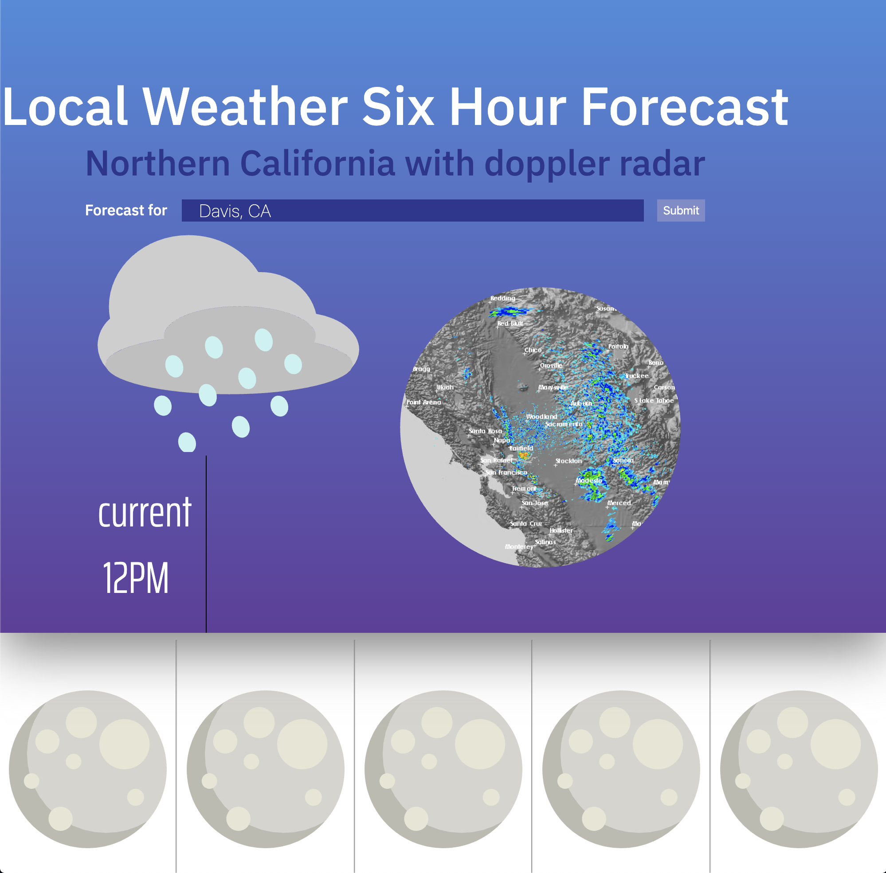
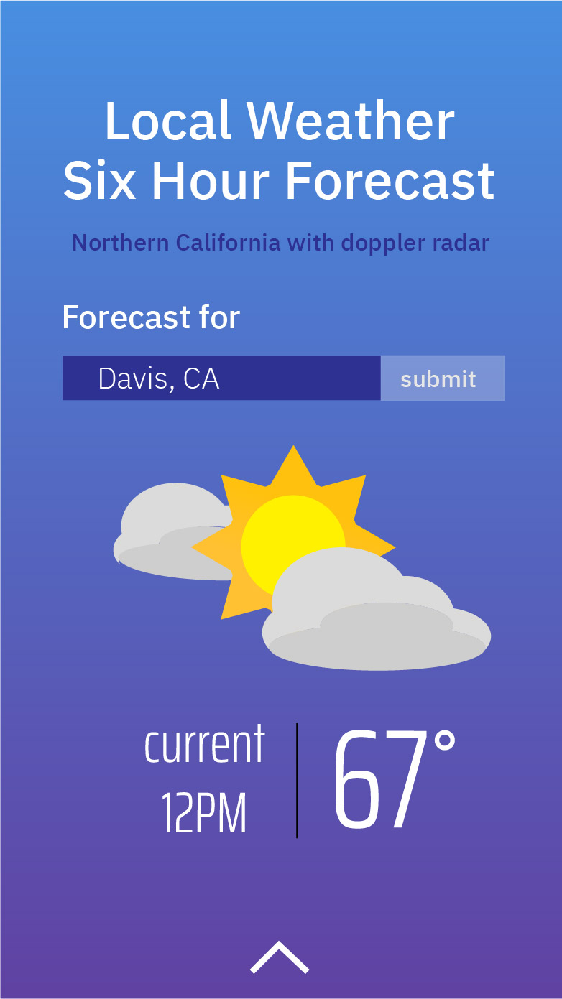
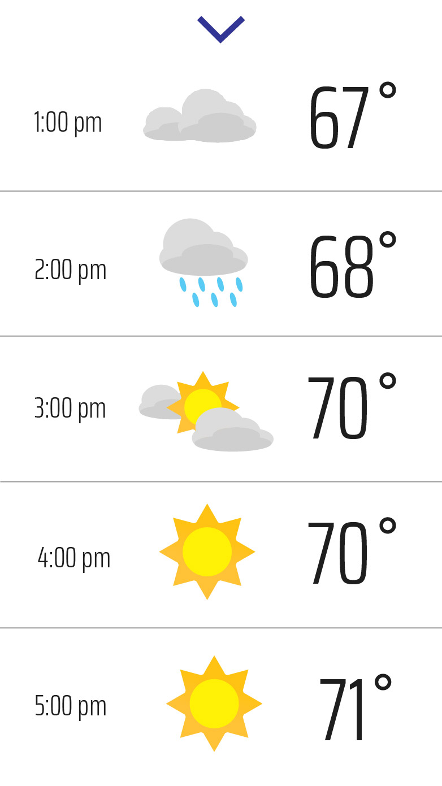
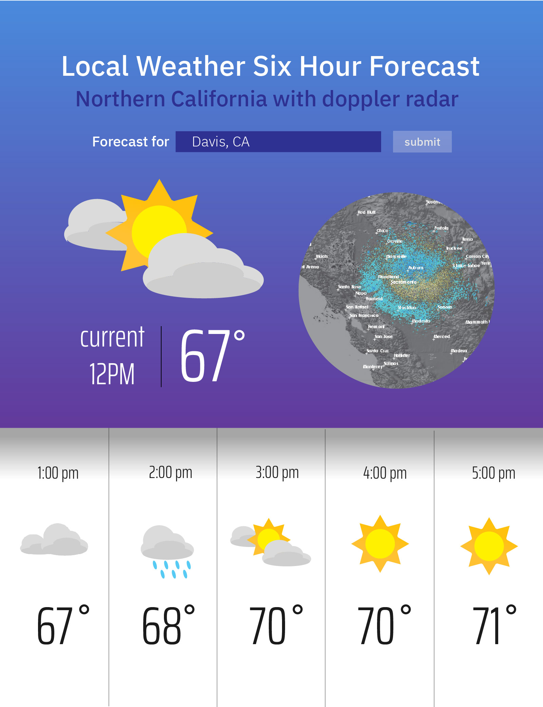

# 6H Weather Forecast App

1) This is what your screen should look like when you open the html file inside the sorce folder:

  
  
2) Go to the source folder and edit the WeatherWebApp.js.

You need to register your own [OpenWeatherMap API Key](https://home.openweathermap.org/users/sign_up) and put it into:
```javascript
let key = "<put your own OpenWehaterMap API key here>";
```
3) If everything is done correctly, this is what you should expect:

<b>Web View<b/>
  


<b>Mobile View: scroll down (home page)<b>
  
 
  
<b>Mobile View: scroll up<b/> 
  
 

<b>Tablet View<b/>
  


Features:

- Dynamic views for web, tablet, and mobile devices

- Animated doppler radar

- Slide-up/down for mobile devices

For a detailed explaination on how to OpenWeatherMap API works, check out the official doc [here](https://openweathermap.org/api/hourly-forecast).
